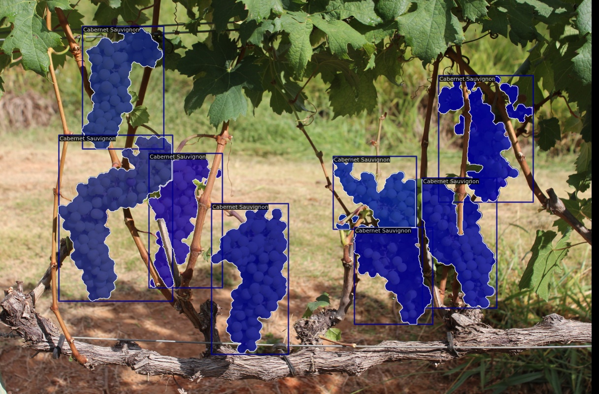

# TutFrutDet

Código que acompanha o tutorial **Detecção de frutos por imagem com redes neurais convolutivas: um tutorial**, parte do 3º volume de livros da Rede de Agricultura de Precisão da Embrapa.



## Instalação

Este tutorial utiliza a biblioteca [MMDetection](https://mmdetection.readthedocs.io) e PyTorch para pipeline de desenvolvimento de um detector de objetos (frutos). Também utilizamos o TensorBoard para monitoramento do processo de treinamento das redes neurais. Os seguintes comandos realizam a instalação de todos essas dependências.

```
miniconda3/condabin/conda create --name openmmlab python=3.9 -y
miniconda3/condabin/conda init bash
conda activate openmmlab
conda install pytorch torchvision torchaudio cudatoolkit=11.3 -c pytorch
conda install tensorboard
pip install -U openmim
mim install mmcv-full
git clone https://github.com/open-mmlab/mmdetection.git
cd mmdetection/
pip install -v -e .
```

## Treinamento

*Em construção*

```
python ./tools/train.py ~/tutfrutdet/minneapple/retinanet_effb3_fpn_crop896_minneapple.py \
--work-dir ~/tutfrutdet/minneapple/retinanet_effb3_fpn_crop896_minneapple
```

## Avaliação e inferência

*Em construção*

```
python ./tools/test.py ~/tutfrutdet/minneapple/retinanet_effb3_fpn_crop896_minneapple/retinanet_effb3_fpn_crop896_minneapple.py \
~/tutfrutdet/minneapple/retinanet_effb3_fpn_crop896_minneapple/latest.pth \
--out ~/tutfrutdet/minneapple/retinanet_effb3_fpn_crop896_minneapple/results.pkl \
--show-dir ~/tutfrutdet/minneapple/retinanet_effb3_fpn_crop896_minneapple/results-output/  \
--eval bbox --show

python ./tools/analysis_tools/analyze_results.py \
~/tutfrutdet/minneapple/retinanet_effb3_fpn_crop896_minneapple/retinanet_effb3_fpn_crop896_minneapple.py \
~/tutfrutdet/minneapple/retinanet_effb3_fpn_crop896_minneapple/results.pkl \
~/tutfrutdet/minneapple/retinanet_effb3_fpn_crop896_minneapple/results-output/ \
--show --topk 7
```

